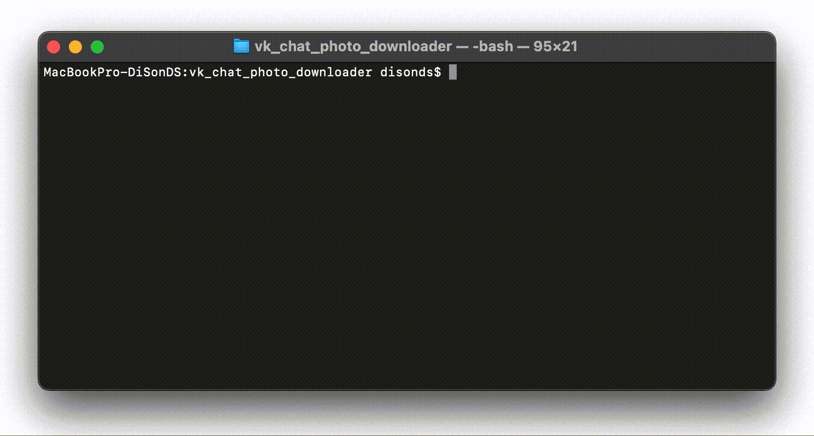

# VK chat photo downloader

[](https://www.python.org/)
[](https://app.codacy.com/gh/DiSonDS/vk_chat_photo_downloader?utm_source=github.com&utm_medium=referral&utm_content=DiSonDS/vk_chat_photo_downloader&utm_campaign=Badge_Grade)

Downloads photos from VK dialogs

## Setup

### Prerequisites

*   Python 3.6+ ([download page](https://www.python.org/downloads/))
*   VK access token (to obtain you can use [vkhost.github.io](https://vkhost.github.io/))

### Installation

1.  Clone the repo
```sh
git clone https://github.com/DiSonDS/vk_chat_photo_downloader.git
```
2.  Install PyPI packages
```sh
pip3 install -r requirements.txt
```
3.  Enter your VK access token in `settings.py`
```Python
VK_USER_TOKEN = 'ENTER YOUR ACCESS TOKEN';
```

## Usage

```console
python3 vk_chat_photo_downloader.py
```

